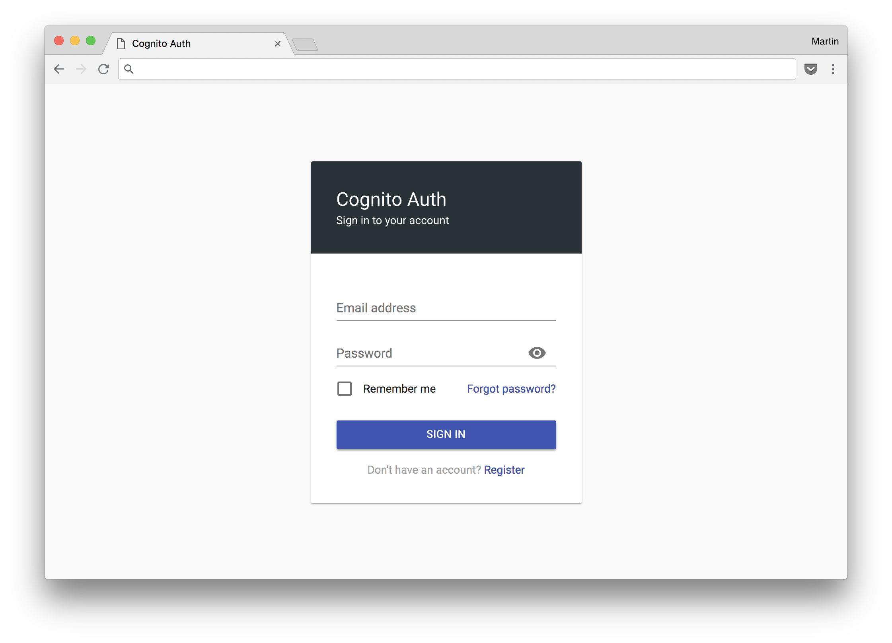
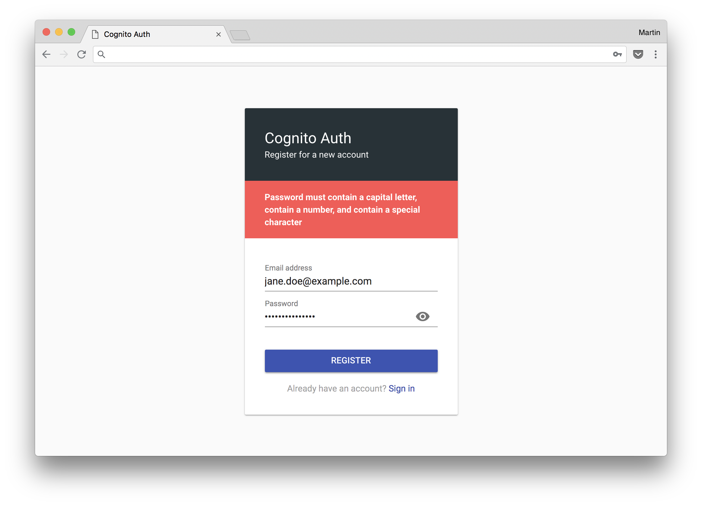
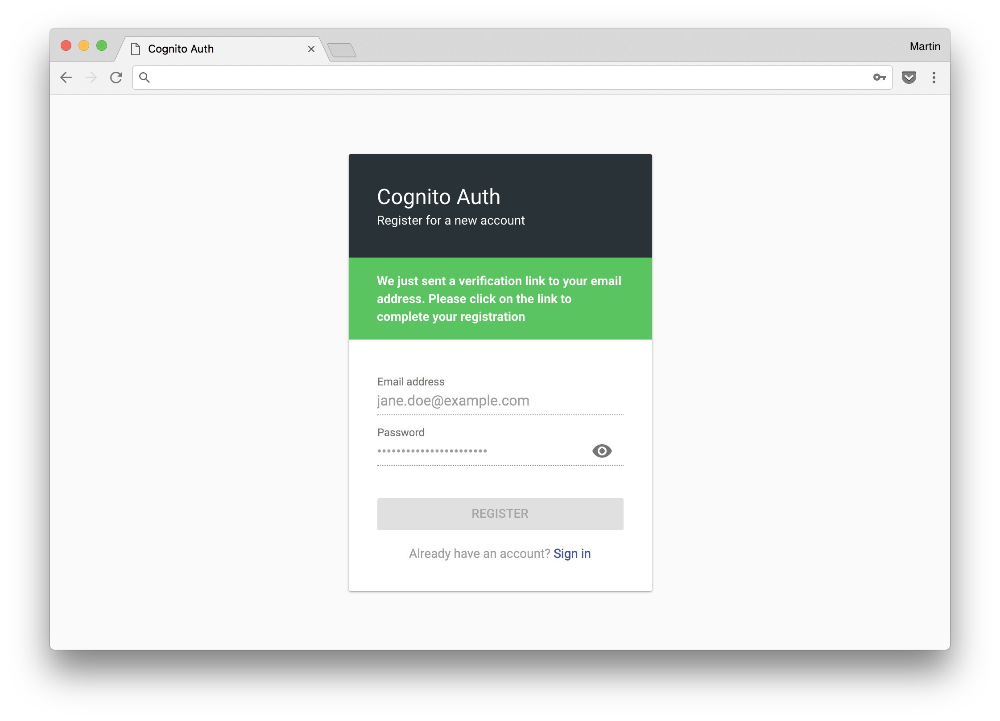
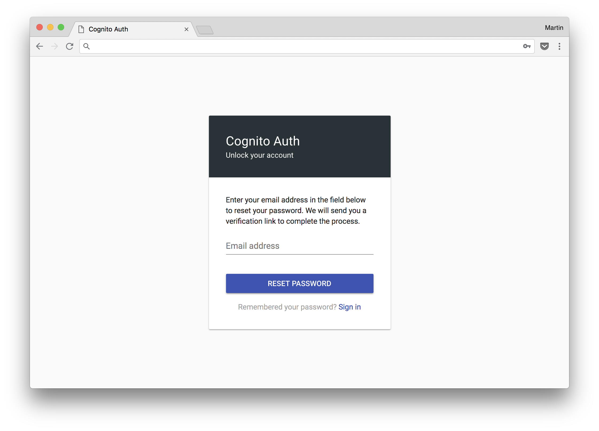
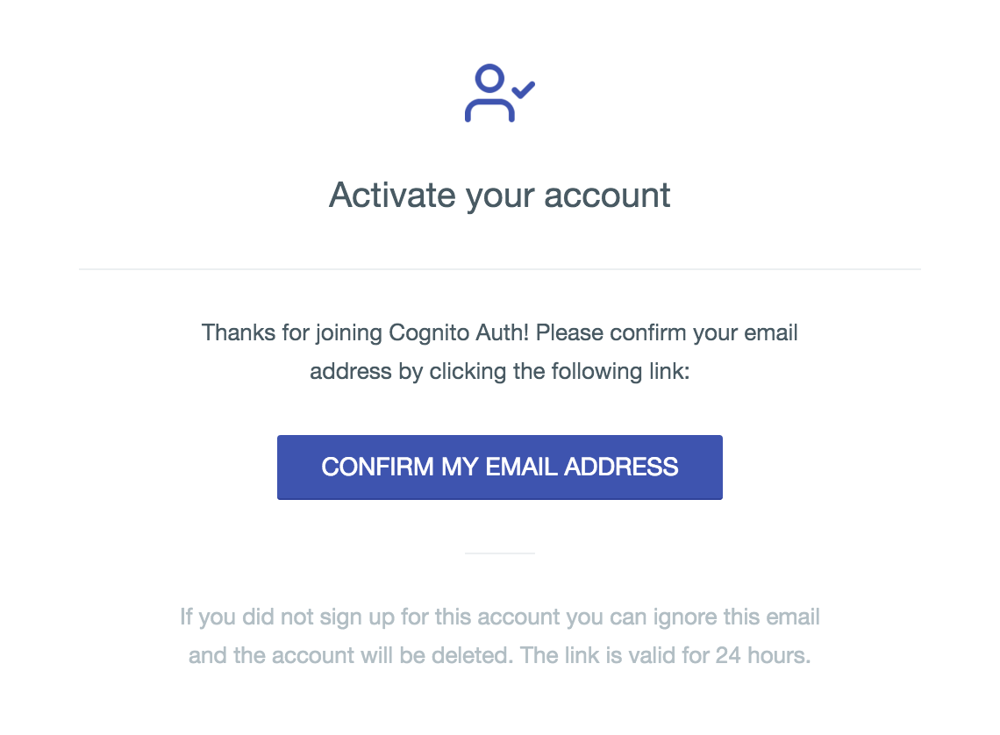
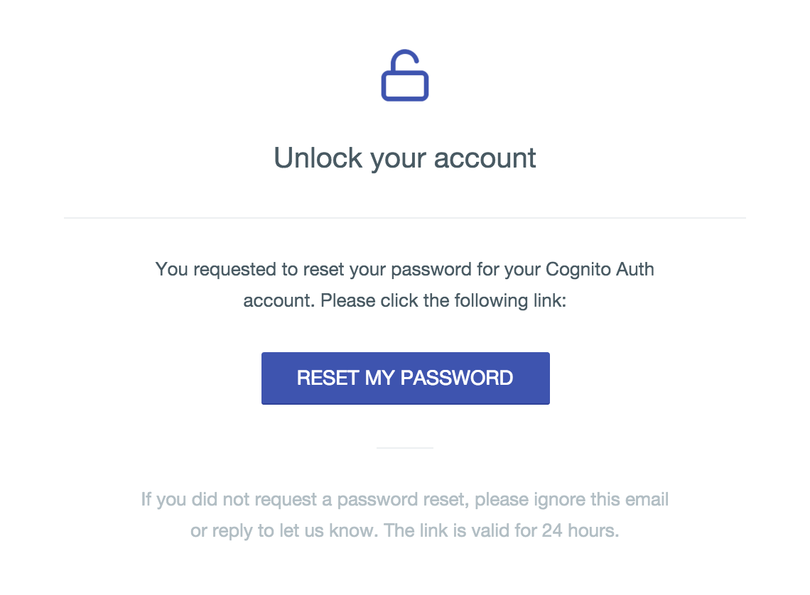

[![Travis][travis-image]][travis-link]
[![Codecov][codecov-image]][codecov-link]
[![Gitter][gitter-image]][gitter-link]
[![GitHub][github-image]][github-link]
[![dependabot][dependabot-image]][dependabot-link]

  [travis-image]: https://travis-ci.org/squidfunk/terraform-aws-cognito-auth.svg?branch=master
  [travis-link]: https://travis-ci.org/squidfunk/terraform-aws-cognito-auth
  [codecov-image]: https://img.shields.io/codecov/c/github/squidfunk/terraform-aws-cognito-auth/master.svg
  [codecov-link]: https://codecov.io/gh/squidfunk/terraform-aws-cognito-auth
  [gitter-image]: https://badges.gitter.im/squidfunk/terraform-aws-cognito-auth.svg
  [gitter-link]: https://gitter.im/squidfunk/terraform-aws-cognito-auth
  [github-image]: https://img.shields.io/github/release/squidfunk/terraform-aws-cognito-auth.svg
  [github-link]: https://github.com/squidfunk/terraform-aws-cognito-auth/releases
  [dependabot-image]: https://img.shields.io/badge/dependabot-enabled-06f.svg
  [dependabot-link]: https://dependabot.com

# Terraform AWS Cognito Auth

> Add authentication to your Single Page Application (SPA) within minutes and
> take full control of the authentication flow including customizable email
> templates and a beautiful default UI. See the [live demo][1].

  [1]: #live-demo

A Terraform module to setup a serverless and easily customizable Authentication
as a Service (AaaS) provider in front of API Gateway using AWS Cognito User
Pools.

## Features

* Authentication using email and password or refresh token
* Registration, password reset and verification
* Completely customizable transactional emails
* Optional multi-part default email templates (see [screenshots][2])
* Optional beautiful and mobile-friendly default UI (see [screenshots][3])
* Federated identities using Cognito Identity Pools and User Pools
* A+ security rating on [Mozilla Observatory][4] (CSP, HSTS, etc.)
* Excessively tested with automated unit and acceptance tests
* Serverless, extremely scalable and [cost effective][5]
* However, there are some [limitations][6]

  [2]: #emails
  [3]: #default-ui-1
  [4]: https://observatory.mozilla.org/
  [5]: #cost
  [6]: #limitations

## Architecture

![Architecture][7]

  [7]: assets/architecture.png

This module creates a REST API using AWS API Gateway, Lambda and Cognito User
Pools to enable registration, authentication and account recovery without the
necessity for the implementation of complex OAuth authentication flows. It was
originally inspired by [LambdAuth][8] but uses User Pools in favor of Identity
Pools because exposing (even temporary) AWS credentials is a security threat.

Account registration and recovery circumvent Cognito's default verification
logic and emit verification codes to an SNS topic which can be hooked up to a
Lambda function handling delivery via SES using default multi-part email
templates. This behavior is optional and can be customized by implementing a
custom Lambda function handling email delivery. Furthermore, a beautiful and
mobile-friendly default UI can be deployed to a custom subdomain within
your hosted zone.

  [8]: https://github.com/danilop/LambdAuth

### Cost

AWS Cognito is [free for up to 50.000 monthly active users][9]. After that,
pricing starts at __$ 0,0055 per monthly active user__. Additional cost will be
attributed to AWS Lambda, API Gateway and CloudFront but it should be very
reasonable compared to what AaaS providers like Auth0 charge. While this module
does not provide all features offered by other providers, it should be quite
sufficient for securing a Single Page Application.

  [9]: https://aws.amazon.com/de/cognito/pricing/

## Usage

Add the following module to your Terraform configuration and apply it:

``` hcl
module "cognito-auth" {
  source  = "github.com/squidfunk/terraform-aws-cognito-auth"
  version = "0.3.2"

  namespace                      = "<namespace>"
  region                         = "<region>"
  cognito_identity_pool_name     = "<pool-name>"
  cognito_identity_pool_provider = "<pool-provider>"

  # Optional: Default UI
  app_hosted_zone_id             = "<hosted-zone-id>"
  app_certificate_arn            = "<certificate-arn>"
  app_domain                     = "<domain>"
  app_origin                     = "<origin-domain>"

  # Optional: Email delivery
  ses_sender_address             = "<email>"
}
```

All resources are prefixed with the value specified as `namespace`. If the S3
bucket name (see below) is not explicitly set, it's set to the given `namespace`
which means there must not already exist an S3 bucket with the same name. This
is a common source of error.

The `cognito_identity_pool_provider` should match the domain name under which
the authentication provider should be deployed, i.e. it should be equal to
`app_domain`. Also note that SES is sandboxed by default, so every email address
needs to be verified for delivery. Contact AWS to [exit sandboxed mode][10] for
production use.

Also see the [example][11] configuration and the [live demo][1].

  [10]: https://docs.aws.amazon.com/ses/latest/DeveloperGuide/request-production-access.html
  [11]: #example

## Configuration

The following variables can be configured:

### Required

#### `namespace`

- __Description__: AWS resource namespace/prefix (lowercase alphanumeric)
- __Default__: `none`

#### `region`

- __Description__: AWS region
- __Default__: `none`

#### `api_stage`

- __Description__: API deployment stage
- __Default__: `"production"`

#### `cognito_identity_pool_name`

- __Description__: Cognito identity pool name
- __Default__: `none`

#### `cognito_identity_pool_provider`

- __Description__: Cognito identity pool provider
- __Default__: `none`

### Optional

#### Default UI

##### `app_hosted_zone_id`

- __Description__: Application hosted zone identifier
- __Implies__: `app_certificate_arn`, `app_domain` and `app_origin`
- __Default__: `""`

##### `app_certificate_arn`

- __Description__: Application domain certificate ARN
- __Implies__: `app_hosted_zone_id`, `app_domain` and `app_origin`
- __Default__: `""`

##### `app_domain`

- __Description__: Application domain
- __Implies__: `app_hosted_zone_id`, `app_certificate_arn` and `app_origin`
- __Default__: `""`

##### `app_origin`

- __Description__: Application origin domain (target domain)
- __Implies__: `app_hosted_zone_id`, `app_certificate_arn` and `app_domain`
- __Default__: `""`

##### `bucket`

- __Description__: S3 bucket name to store static files
- __Default__: `"${var.namespace}"` (equal to namespace)

#### Email delivery

##### `ses_sender_address`

- __Description__: SES sender email address
- __Default__: `""`

## Example

Let's say we want to secure an application hosted under `admin.example.com`
using the default UI. First, add the following lines to your Terraform
configuration and apply it:

``` hcl
module "cognito-auth" {
  source  = "github.com/squidfunk/terraform-aws-cognito-auth"
  version = "0.3.2"

  namespace                      = "example-auth"
  region                         = "us-east-1"
  cognito_identity_pool_name     = "Example Auth"
  cognito_identity_pool_provider = "login.example.com"

  # Optional: Default UI
  app_hosted_zone_id             = "Z*************"
  app_certificate_arn            = "arn:aws:acm:us-east-1:..."
  app_domain                     = "login.example.com"
  app_origin                     = "admin.example.com"

  # Optional: Email delivery
  ses_sender_address             = "accounts@example.com"
}
```

Now, when the user visits `admin.example.com/dashboard`, the initial API request
should detect a `401 Unauthorized` response for an invalid or expired identity
token and redirect to the default UI:

```
https://login.example.com/?redirect=dashboard
```

After successful authentication, the default UI will redirect to the URL
specified in `app_origin` appending the path part specified in the `redirect`
parameter and the identity token in an URI fragment:

```
https://admin.example.com/dashboard#token=<token>&expires=<timestamp>
```

Then, after parsing the URI fragment and extracting the token, the application
can repeat the request including the identity token as an authorization header:

```
Authorization: Bearer <token>
```

If the user checks the __Remember me__ checkbox during the authentication
process, a refresh token that is valid for 30 days is issued and sent to the
client as a secure HTTP-only cookie. When the access token expires after 1 hour,
the client is again redirected to the default UI which will immediately perform
a password-less authentication using the refresh token.

To sign out, the application must redirect the user to the following URL:

```
https://login.example.com/leave
```

This will invalidate all tokens including the refresh token stored in the
secure HTTP-only cookie.

## Demo

### Live demo

A live demo of this project can be found [here][12]. Please note that emails
are configured to remain undelivered due to security reasons. If you want to
try authentication, you may use the following credentials:

```
Username: jane.doe@example.com
Password: depl0y&D3STROY
```

The target domain is `localhost:8000`, so you can start a local development
server on that port in order to receive the identity token after a successful
authentication attempt.

  [12]: https://terraform-aws-cognito-auth.play.squidfunk.com/

### Screenshots

#### Default UI

   

#### Emails

 

## Limitations

By default, AWS Cognito does only allow minor customizations of the whole
authentication flow - specifically multi-part emails are not supported; welcome
to the 21st century. To work around these restrictions registration and password
reset were decoupled using the Cognito Identity Service Provider admin APIs.
Verification is implemented with custom verification codes and email delivery.
However, as Cognito currently does not support setting the password for a user
through the admin API, the user is deleted and recreated with the exact same
identifier (a UUID). This is heavily tested with acceptance tests and just
works, but it's not ideal. Hopefully AWS will address these issues in the
future.

## License

__MIT License__

Copyright (c) 2018 Martin Donath

Permission is hereby granted, free of charge, to any person obtaining a copy
of this software and associated documentation files (the "Software"), to
deal in the Software without restriction, including without limitation the
rights to use, copy, modify, merge, publish, distribute, sublicense, and/or
sell copies of the Software, and to permit persons to whom the Software is
furnished to do so, subject to the following conditions:

The above copyright notice and this permission notice shall be included in
all copies or substantial portions of the Software.

THE SOFTWARE IS PROVIDED "AS IS", WITHOUT WARRANTY OF ANY KIND, EXPRESS OR
IMPLIED, INCLUDING BUT NOT LIMITED TO THE WARRANTIES OF MERCHANTABILITY,
FITNESS FOR A PARTICULAR PURPOSE AND NON-INFRINGEMENT. IN NO EVENT SHALL THE
AUTHORS OR COPYRIGHT HOLDERS BE LIABLE FOR ANY CLAIM, DAMAGES OR OTHER
LIABILITY, WHETHER IN AN ACTION OF CONTRACT, TORT OR OTHERWISE, ARISING
FROM, OUT OF OR IN CONNECTION WITH THE SOFTWARE OR THE USE OR OTHER DEALINGS
IN THE SOFTWARE.
