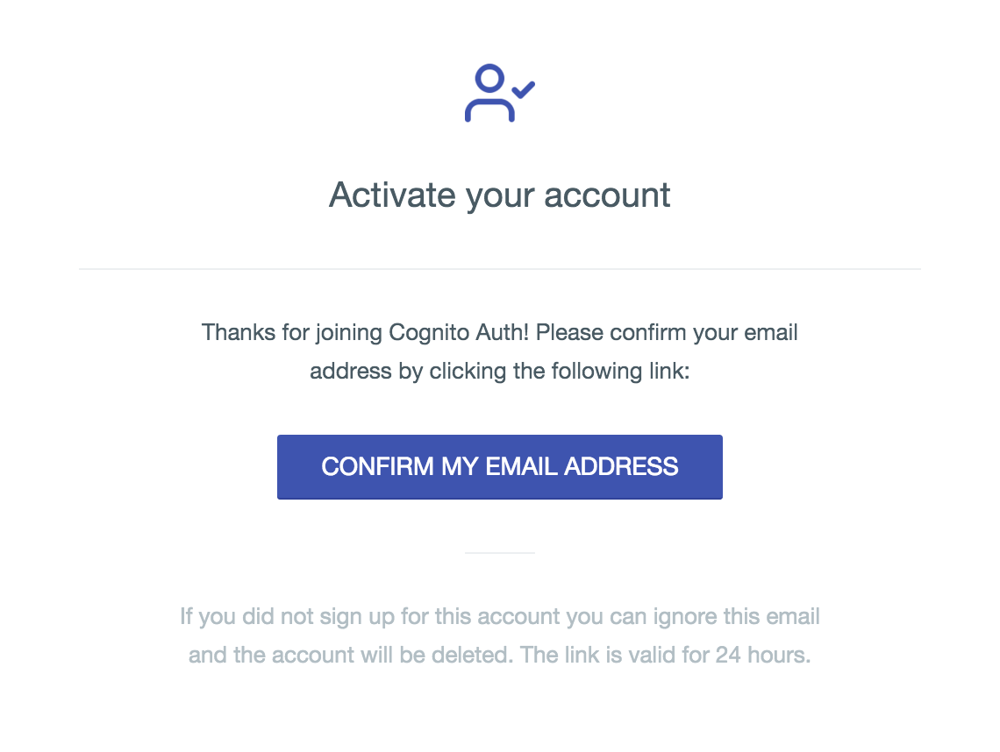

[![Travis][travis-image]][travis-link]
[![Codecov][codecov-image]][codecov-link]
[![Gitter][gitter-image]][gitter-link]
[![GitHub][github-image]][github-link]

  [travis-image]: https://travis-ci.org/squidfunk/terraform-aws-cognito-auth.svg?branch=master
  [travis-link]: https://travis-ci.org/squidfunk/terraform-aws-cognito-auth
  [codecov-image]: https://img.shields.io/codecov/c/github/squidfunk/terraform-aws-cognito-auth/master.svg
  [codecov-link]: https://codecov.io/gh/squidfunk/terraform-aws-cognito-auth
  [gitter-image]: https://badges.gitter.im/squidfunk/terraform-aws-cognito-auth.svg
  [gitter-link]: https://gitter.im/squidfunk/terraform-aws-cognito-auth
  [github-image]: https://img.shields.io/github/release/squidfunk/terraform-aws-cognito-auth.svg
  [github-link]: https://github.com/squidfunk/terraform-aws-cognito-auth/releases

# Terraform AWS Cognito Auth

> Add authentication to your Single Page Application (SPA) within minutes and
> take full control of the authentication flow including customizable email
> templates and a beautiful hosted UI.

A Terraform module to setup a serverless and easily customizable Authentication
as a Service (AaaS) provider in front of API Gateway using AWS Cognito.

## Features

* Authentication using email and password or refresh token
* Registration, password reset and verification
* Completely customizable transactional emails
* Optional default multi-part email templates (see [screenshots][1])
* Optional beautiful and mobile-friendly hosted UI (see [screenshots][2])
* Federated identities using Cognito identity and user pools
* __A+__ security rating on [Mozilla Observatory][3] (CSP, HSTS, etc.)
* Excessively tested with automated unit and acceptance tests
* Serverless, extremely scalable and [cost effective][4]

  [1]: #email
  [2]: #hosted-ui
  [3]: https://observatory.mozilla.org/
  [4]: #cost

## Architecture

![Architecture][5]

  [5]: assets/architecture.png

This module creates a REST API using AWS API Gateway, Lambda and Cognito to
enable registration, authentication and account recovery without the need for
complex OAuth authentication flows. Account registration and recovery emit
verification events to an AWS SNS topic which can be hooked up to a Lambda
function handling delivery via AWS SES using default multi-part email templates.
Furthermore, a beautiful and mobile-friendly hosted UI can be deployed to a
custom subdomain within your hosted zone.

### Cost

AWS Cognito is [free for up to 50.000 monthly active users][5]. After that,
pricing starts at __$ 0,0055 per monthly active user__. Additionally, the bulk
of the cost will be attributed to AWS Lambda, API Gateway and CloudFront but
it should be quite low compared what other AaaS providers like Auth0 charge.
While this module does not provide all features offered by other AaaS providers,
it should be absolutely sufficient for Single Page Applications.

  [6]: https://aws.amazon.com/de/cognito/pricing/

## Usage

### Prerequisites

TBD

### Setup

``` hcl
module "cognito-auth" {
  source  = "github.com/squidfunk/terraform-aws-cognito-auth"
  version = "0.1.0"

  namespace                      = "<namespace>"
  region                         = "<region>"
  cognito_identity_pool_name     = "<pool-name>"
  cognito_identity_pool_provider = "<pool-provider>"

  # Necessary for hosted UI
  app_hosted_zone_id             = "<hosted-zone-id>"
  app_certificate_arn            = "<certificate-arn>"
  app_domain                     = "<domain>"
  app_origin                     = "<origin-domain>"

  # Optional: email delivery
  ses_sender_address             = "<email>"
}
```

## Configuration

### Required

#### `namespace`
#### `region`
#### `api_stage`
#### `cognito_identity_pool_name`
#### `cognito_identity_pool_provider`

### Optional

#### Email delivery

##### `ses_sender_address`

#### Web application

##### `app_hosted_zone_id`
##### `app_certificate_arn`
##### `app_domain`
##### `app_origin`

## Outputs

TBD

## Screenshots

### Hosted UI

   

### Email



## Limitations

TBD

## License

**MIT License**

Copyright (c) 2018 Martin Donath

Permission is hereby granted, free of charge, to any person obtaining a copy
of this software and associated documentation files (the "Software"), to
deal in the Software without restriction, including without limitation the
rights to use, copy, modify, merge, publish, distribute, sublicense, and/or
sell copies of the Software, and to permit persons to whom the Software is
furnished to do so, subject to the following conditions:

The above copyright notice and this permission notice shall be included in
all copies or substantial portions of the Software.

THE SOFTWARE IS PROVIDED "AS IS", WITHOUT WARRANTY OF ANY KIND, EXPRESS OR
IMPLIED, INCLUDING BUT NOT LIMITED TO THE WARRANTIES OF MERCHANTABILITY,
FITNESS FOR A PARTICULAR PURPOSE AND NON-INFRINGEMENT. IN NO EVENT SHALL THE
AUTHORS OR COPYRIGHT HOLDERS BE LIABLE FOR ANY CLAIM, DAMAGES OR OTHER
LIABILITY, WHETHER IN AN ACTION OF CONTRACT, TORT OR OTHERWISE, ARISING
FROM, OUT OF OR IN CONNECTION WITH THE SOFTWARE OR THE USE OR OTHER DEALINGS
IN THE SOFTWARE.
